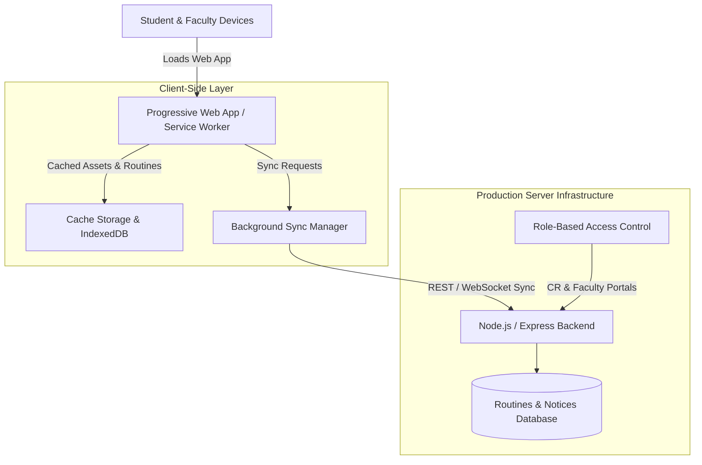

# UniRoutine 📅
### Campus-Wide Academic Schedule & Real-Time Notification Platform
*An offline-first Progressive Web App (PWA) designed to eliminate campus scheduling confusion and provide real-time updates.*

[](LICENSE)
[](#offline-first-architecture)
[](https://developer.mozilla.org/)
[](#deployment)

---

## 📌 Problem & Motivation

University timetables are often fragmented across scattered PDF files, WhatsApp group messages, and physical notice boards. When class times shift or professors take emergency leave, students frequently arrive on campus only to find an empty classroom.

**UniRoutine** was engineered to solve this problem for our entire university campus:
1. **Centralized Timetables**: Aggregates course routines and schedules across all departments and semesters into a single, clean user interface.
2. **Faculty Directory**: Gives students instant access to faculty office hours, department designations, and contact emails.
3. **Role-Based Real-Time Notices**: Enables authorized Class Representatives (CRs) and faculty members to post instantaneous schedule updates and room changes.
4. **Offline-First PWA Architecture**: Rather than requiring students to pay or download large app-store packages, UniRoutine runs as an installable Progressive Web App (PWA) with client-side caching, functioning 100% offline with zero latency even during campus Wi-Fi outages.

---

## 🏛️ System Architecture



---

## ⚡ Key Features

* **Multi-Department & Multi-Semester Support**: One-click switching between CSE, EEE, BBA, and other departments with semester-specific routine filters.
* **Instant CR & Faculty Broadcast**: Authorized Class Representatives can publish urgent announcements (e.g., *"Class postponed by 30 mins"* or *"Room shifted to 402"*), syncing instantly across active users.
* **Zero App-Store Friction (PWA)**: Installable directly from the browser onto Android, iOS, Windows, and macOS with an app icon, without requiring Google Play Store or Apple App Store accounts.
* **100% Offline Availability**: Cached routines and directory data are served directly from local device storage if internet access is interrupted.
* **Production Deployed**: Transitioned from a local prototype to a live deployment hosted directly on university student server infrastructure.

---

## 🛠️ Tech Stack

* **Frontend**: HTML5, CSS3, JavaScript (ES6+), Progressive Web App API (Service Workers, Web App Manifest).
* **Backend**: Node.js / Express REST API (with WebSocket support for live notice broadcasts).
* **Storage**: Lightweight JSON / SQLite database with client-side IndexedDB caching.
* **Hosting**: University-provided Linux server instance with Nginx reverse proxy.
* **Developer Velocity**: Accelerated development using modern AI agent workflows (Google Antigravity IDE & Cline).

---

## 🚀 Quick Start (Local Setup)

### 1. Clone the repository
```bash
git clone https://github.com/mobin2021/uniroutine.git
cd uniroutine
```

### 2. Install dependencies
```bash
npm install
```

### 3. Start development server
```bash
npm start
```
Open `http://localhost:3000` in your browser.

---

## 📱 Installing as a PWA
1. Open the web app in Chrome, Edge, or Safari on your phone or PC.
2. Click the **"Install"** or **"Add to Home Screen"** prompt in the browser bar.
3. UniRoutine is now installed as a native-feeling standalone app with full offline capabilities!

---

## 📄 License
Distributed under the MIT License. See `LICENSE` for details.
